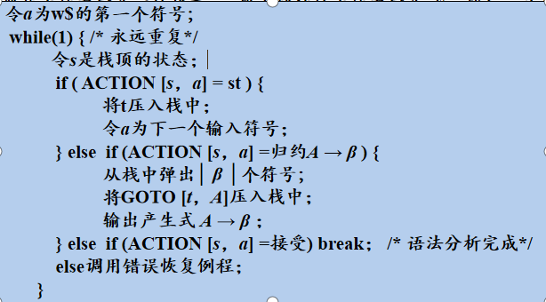
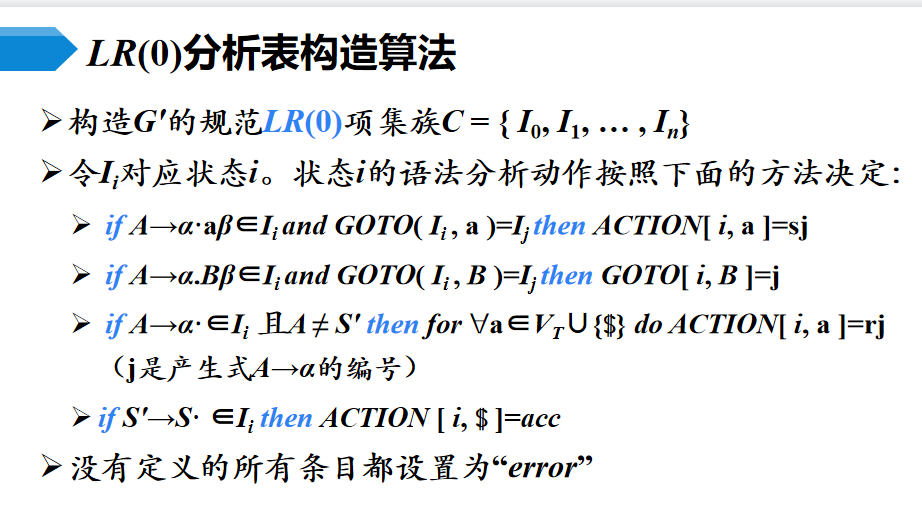
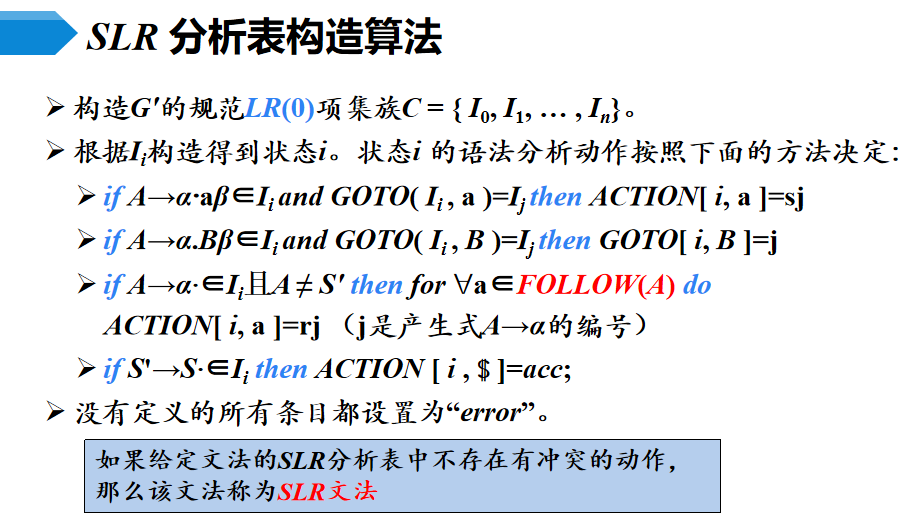
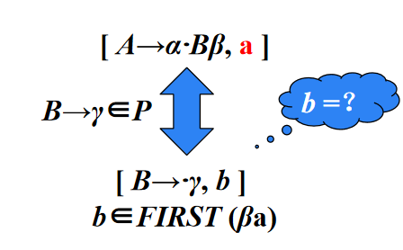
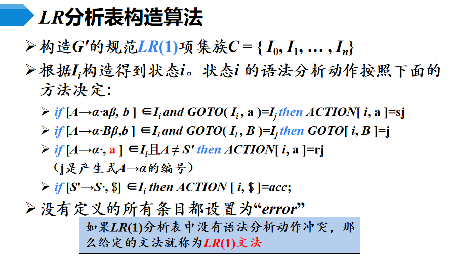
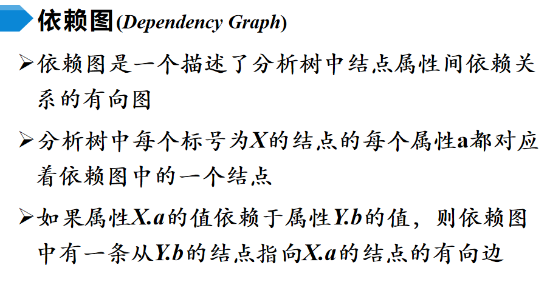
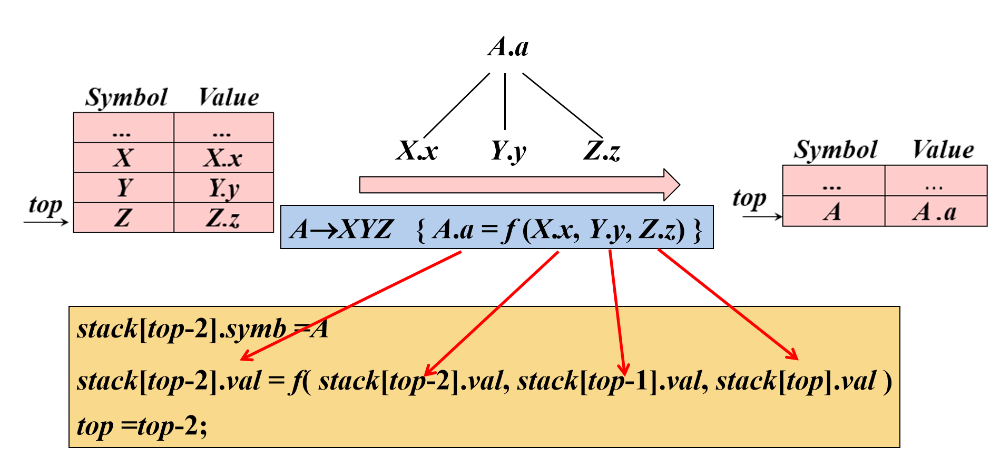
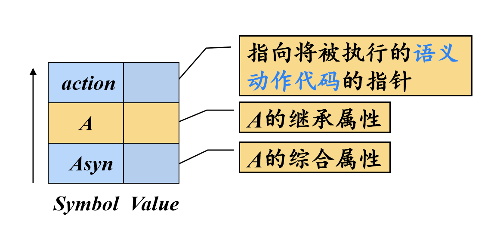
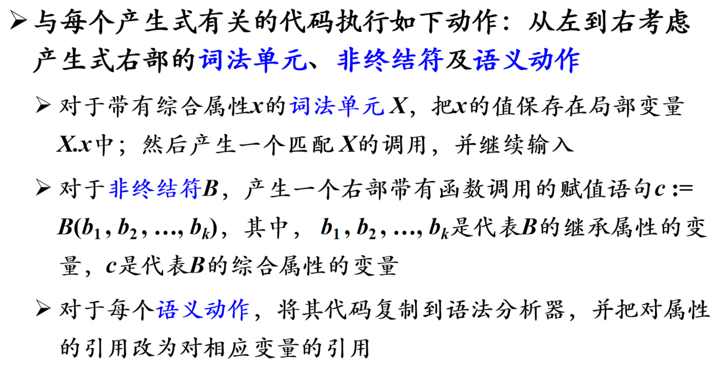
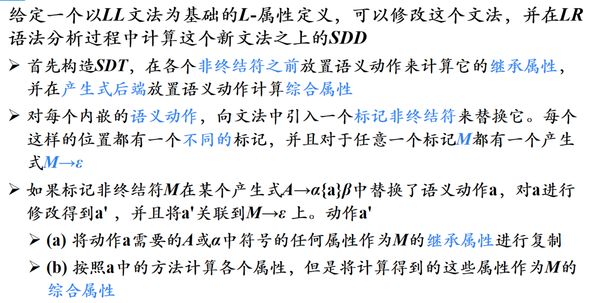

# 第四章 语法分析
## 4.1 自顶向下的分析
  从开始开始符号推导出词串（从分析树的顶部向底部构造分析数）的过程。

  每一步都需要做两个选择
   - 替换当前句型中的哪个非终结符
   - 用该非终结符
  
  最左推导：总是选择每个句型最左非终结符进行替换。
   - 最左句型：如果$S \Rightarrow ^*_{lm} \alpha$，则称$\alpha$为当前文法的最左句型。 

  类似的，有最右推导以及最右句型。

  自底向上地分析中，总是采用最左规约的方法，所以把最左规约称为规范规约，<mark>而最右推导相应的称为规范推导，最右句型也称为最右句型。</mark>

  因为最左的非终结符和最右的非终结符是唯一的，所以最左推导和最右推导具有唯一性。

  自顶向下语法分析的通用形式：<mark>递归下降分析</mark>
   - 由一组过程组成，每一个过程对应文法的一个非终结符。
   - 从开始符号S对应的过程开始，其中递归调用文法中其他非终结符对应的过程。如果S对应的过程恰好扫描了整个输入串。则成功完成语法分析。
  
  伪代码如下：

    void A(){
      选择一个A的产生式，$A \rightarrow X_1X_2...X_k$
      for(i = 1 to k){
        if($X_i是一个非终结符$)             调用过程$X_i()$;
        else if($X_i$等于当前的输入符号a)   读入下一个输入符号；
        else                               error
      }
    }

  自顶向下分析过程中的问题：（候选式冲突）
   - 同一非终结符的多个候选是存在共同前缀，将<mark>回溯</mark>。(不确定分析)
   - 左递归文法会使递归下降分析器陷入无限循环。
     - 非终结符A使得对某个串$\alpha$存在一个推导$A\Rightarrow^+Aa$，那么这个文法就是左递归的。
     - $A\rightarrow A\alpha$为直接左递归。
  
  解决方法：
   - 消除直接左递归：（把左递归转换成右递归，引入了一些非终结符和$\varepsilon$-产生式）
   - 消除间接左递归：
   - 提取左公因子：改写产生式来推迟决定，读入足够多的输入获得足够的信息再做决定。

## 4.2 预测分析法
  预测分析：是递归下降分析技术的一个特例，通过在输入中<mark>向前看固定个数符号</mark>开选择正确的产生式。
   - 向前看k个输入符号，则称为LL(k)文法。
   - 不需要回溯，确定的。

  工作过程：从开始符号出发，每一步推导中，根据当前句型的最左非终结符A和当前的输入符号a选择正确的A-产生式。选出的候选是必须唯一。（保证确定性）

  S_文法：（简单的确定性文法）
   - 每个产生式的右部都以终结符开始。
   - 同一非终结符的各个候选式的首终结符都不同。
   - <mark>不含空产生式。</mark>
   - 空产生式会导致本应该提早报错的串延迟报错。
  
  空产生式的使用：若输入符与当前非终结符不匹配，且可以出现在当前非终结符的后面，则可以使用空产生式。由此引出后续符号集的概念。
  
  非终结符的后续符号集：可能在某个句型中紧跟在A后面的终结符a的集合。记为$FOLLOW(A) =\{ a|S\Rightarrow^*\alpha Aa\beta,a\in V_T,\alpha,\beta\in(V_T\bigcup V_N)^*\}$

  产生式的可选集：产生式进行推导时对应的输入符号的集合。记为$SELECT(A\rightarrow\beta)$
   - $SELECT(A\rightarrow a\beta) = \{a\}$
   - $SELECT(A\rightarrow \varepsilon) = FOLLOW(A)$

  q_文法：
   - 每个产生式的右部或为$\varepsilon$，或以终结符开始。
   - 具有相同的做不的产生式有不相交的可选集。（不含右部以非终结符打头的产生式）

  串首终结符集：给定一个文法符号串，其首部终结符集为可以从符号串$\alpha$推导出的所有串首终结符（串首第一个符号，并且是终结符）构成的集合。记为$FIRST(\alpha)$。<mark>可以包含$\varepsilon$</mark>
   - $FIRST(\alpha) = \{a|\alpha \Rightarrow^* a\beta,a\in V_T,\beta\in(V_T \bigcup V_N)^*\}$
   - $FIRST(\alpha = X_1X_2...X_k) = FIRST(X_1){\underset {if X_1\Rightarrow^*\varepsilon}{\operatorname {\bigcup} }}FIRST(X_2){\underset {if X_2\Rightarrow^*\varepsilon}{\operatorname {\bigcup} }}FIRST(X_3)...$

  产生式$A\rightarrow\alpha$的可选集：
   - 如果$\varepsilon \in FIRST(\alpha)$，那么$SELECT(A\rightarrow\alpha) = FIRST(\alpha)$
   - 如果$\varepsilon\in FIRST(\alpha)$,那么$SELECT(A\rightarrow\alpha) = (FIRST(\alpha) - \varepsilon)\bigcup FOLLOW(A)$

  LL(1)文法：(从左向右扫描，最左推导，向前看一个输入符号)
   - 文法G是LL(1)的，当且仅当G的任意两个具有相同左部的产生式$A\rightarrow \alpha|\beta$满足下面的条件：
     - 不存在终结符a使得$\alpha$和$\beta$都能够推导出以a开头的串
     - $\alpha$和$\beta$之多能有一个推导出$\varepsilon$
     - 如果$\beta \Rightarrow^* \varepsilon$，则$FIRST(\alpha)\bigcap FOLLOW(A) = \Phi$
     - 如果$\alpha \Rightarrow^* \varepsilon$，则$FIRST(\beta)\bigcap FOLLOW(A) = \Phi$
  
  计算非终结符A的FOLLOW(A):
   - 将$放入FOLLOW(S)中，S为开始符号。
   - 如果存在一个产生式$A\rightarrow aB\beta$，那么$FIRST(\beta)$中除$\varepsilon$之外的符号都在FOLLOW(B)中。
   - 如果存在一个产生式$A\rightarrow\alphaB$，或存在一个产生式$A\rightarrow\alphaB\beta$且FIRST($\beta$)中包含$\varepsilon$，那么FOLLOW(A)的所有符号都在FOLLOW(B)中。

  实现预测分析：
   - 递归的方式：基于预测分析表对递归下降分析法进行拓展。
   - 非递归的方式：显式地维护一个栈结构。可以模拟最左推导过程。
  
  递归的预测分析法：是对递归下降分析框架的扩展。

  伪代码如下：(其中$A\rightarrow\alpha_1|\alpha_2|\cdots|\alpha_n,\alpha_i = X_1X_2...X_k$)

    A(Token){
      if(Token \in SELECT(a \rightarrow \alpha_1))
        code1;
      if(Token \in SELECT(a \rightarrow \alpha_2))
        code2;
      ...
    }

    codei{
      for(j = 1 to k){
        if X_j \in v_T
          if X_j == Token     then GetNext(Token)
          else(X_j != Token)  Error()
        else(X_j \in V_N)     X_j()
      }
    }

  非递归的预测分析法：

  预测分析法实现步骤：
    1.构造文法
    2.改造文法：消除二义性、消除左递归、消除回溯
    3.求每个变量的FIRST集、FOLLOW集，从而得到SELECT集
    4.检查是不是LL(1)文法。若是，构造预测分析表
    5.对于递归的预测扥西，根据预测分析表为每一个非终结符编写一个过程；对于非递归的预测分析，实现表驱动的预测分析算法   

  无二义性与确定性：
   - 二义性：一个文法存在某个句型对应两种不同的语法树或者两种不同的最左（右）推导。二义性具有不可判定性。若能早出一个句型对应两种不同的语法树，则该文法必是二义性的。

  错误检测：
   - 栈顶终结符和当前输入符号不匹配。
   - 栈顶非终结符与当前输入符号在预测分析表中对应的项为空。

  错误恢复：恐慌模式
  忽略输入中的一些符号，知道输入中出现由设计者选定的同步词法单元集合中的某个词法单元。
   - 效果依赖于同步集合的选取。
   - 如果终结符在栈顶而不能匹配，一个简单的办法是弹出。

## 4.3 自底向上地语法分析
  采用最左规约方式（反向构造句子的最右推导）
   - 通用框架：移入-归约分析
   - 栈   剩余输入   动作
   - 栈内符号串 + 生育输入 = 规范句型
   - 每次归约的符号串称为句柄
   - 工作过程：
     - 从左到右扫描将字符串移入栈中，知道对栈顶串进行归约
     - 将栈顶串规约为某个产生式的左部
     - 不断重复，知道检测到一个语法错误，或者占中包含了开始符号且输入缓冲区为空（成功万恒语法分析）为止
   - 4种动作：移入、归约、接收、报错

  存在的问题：
   - 归约-归约冲突：错误地识别了句柄（不同产生式有相同的右部 或者 产生式的右部是另一产生式的后缀）
     - 正确的识别句柄：句型的最左直接短语
   - 移入-归约冲突（某一产生式的右部是另一产生式的前缀）

## 4.4 LR分析法
  用来构造相应的移入-归约语法分析器。

  L：对输入进行从左到右的扫描，R：反向构造出一个最右推导序列   

  LR(k)表示向前查看k个输入符号的LR分析。省略时默认为1. 

  基本原理：自底向上地关键问题是如何正确的识别句柄。句柄是逐步形成的，用状态表示句柄识别的进展程度。基于状态来构造自动机进行句柄的识别。
   - $S\rightarrow \dotbBB$  移进状态
   - $S\rightarrow b\dot BB$  待约状态
   - $S\rightarrow bB\dot B$  待约状态
   - $S\rightarrow bBB\dot$  归约状态

  LR分析表的结构：
   - sn：将符号a，状态n压入栈
   - rn：用第n 个产生式进行归约

  LR分析器的工作过程以及LR分析算法。
  

  LR(0)项目：右部某位置标有原点的产生式称为相应文法的一个LR(0)项目
   - 移进项目、待约项目、归约项目
   - 项目描述了句柄识别的状态

  增广文法：如果是一个以S为开始符号的文法，则G的增广文法 G'就是在G中加上新开始符号S'和产生式$S'\rightarrow S$而得到的文法。
   - 使文法开始符号仅出现在一个产生式的左边，从而使分析器只有一个接受状态。
  
  后继项目:同属于一个产生式的项目，但远点的位置只相差一个符号，则称后者是前者的后继项目。

  等价的项目：原点后为非终结符。所有等价的项目组成一个项目集(I)，称为项目集闭包，每个项目集闭包对应着自动机的一个状态。

  栈中都是规范句型的活前缀：
   - 是某一规范句型的前缀（栈中内容+剩余输入符号 = 规范句型）
   - 不越过规范句型的句柄

  CLOSURE函数：计算给定项目集I的闭包。

  GOTO函数：返回项目集I对应于文法符号X的后继项目集闭包。

  构造LR(0)自动机的状态集（即LR(0)项集族）

  分析表构造方法
  

  LR(0)自动机形式化定义： 
   - 文法：$G = (V_N,V_T,P,S)$
   - LR(0)：$M = (C,V_N\bigcup V_T,GOTO,I_0,F)$

  LR(0)的冲突：
   - 移入/归约冲突：$U\rightarrow X\dot aY(下一步要移入a)  V\rightarrow X\dot(下一步要归约)$
   - 归约/归约冲突：$u\rightarrow X\dot   V\rightarrow X\dot   U\rightarrow XY\dot  V\rightarrow Y\dot（下一步都是归约）$
   - LR(0)消除不了某些冲突：句柄的识别应该放在句型这样一个上下文环境中。

  SLR分析：
   - 已知项目集I：
   - 如果集合（归约项目的FOLLOW集以及移进项目的终结符$\{a_1,a_2,...,a_n\}$）两两不想交，则冲突可以按以下原则解决：
     - 设a是下一个输入符号
     - 如果$a\in\{a_1,a_2,...,a_n\} $，则移进
     - 如果$a\in FOLLOW(B_i) $，则用$B_i$产生式归约
     - 此外，报错
   - 构造算法
     -   
   - 冲突： 
     - 如果集合相交
     - 只考虑下一个输入符号是否属于归约项目相关的FOLLOW集中。但是属于只是归约的必要条件，而非充分条件。（归约一定要属于，但是属于不一定归约）

  LR(0)表中归约的一行都是归约，而SLR中未必。
  
  LR(1)分析：
   - 对于产生式的归约，在不同的位置，会要求不同的后继符号
   - 规范LR(1)项目A $[A\rightarrow \alpha\dot\beta,a]$，其中a是一个终结符，为A后面必须紧跟的终结符，称为展望符。展望符为FOLLOEW集的子集，通常为真子集。
   - 等价LR(1)项目
     - 
   - 同心的两个LR(1)项目：除展望符外，两个项目集是相同的。
   - 构造算法：
     - 
  
  LALR分析：将具有相同核心（第一分量的集合）的LR(1)项目合并为一个项目，
   - 会产生归约-归约冲突
   - 不产生移入-归约冲突
   - 会推迟错误发现：会做多余的归约动作，但绝不会做错误的移进动作
   - 特点：
     - 形式上与LR(1)相同
     - 大小上与LR(0)相同
     - 分析能力结余SLR和LR(1)之间

  二义性文法都不是LR的。二义性文法更简洁，更自然。
   - 引入算数的优先级来消除LR文法中的二义性。
   - 就近匹配原则来消除LR文法中的二义性。

  LR分析中的错误处理：
   - 语法错误检测：当LR分析器在查询分析表并发现一个报错条目时，就检测到了一个语法错误
   - 错误恢复策略：
     - 恐慌模式
       - 从栈顶向下扫描，直到发现某个状态si，它有一个对应于某个非终结符A的GOTO目标，可以认为从这个A推导出的串中包含错误
       - 然后丢弃0个或多个输入符号，直到发现一个可能合法地跟在A之后的符号a为止。
       - 之后将$s_i+1 = GOTO(s_i , A)$压入栈中，继续进行正常的语法分析
     - 短语层次
       - 检查LR分析表中的每一个报错条目，并根据语言的使用方法来决定程序员所犯的何种错误最有可能引起这个语法错误
       - 然后构造出适当的恢复过程

# 第五章 语法制导翻译
## 5.1 语法制导翻译概念
  语义制导定义(SDD)：
   - 每个文法符号和一个语义属性集合相关联
   - 每个产生式和一组语义规则相关联
   - X为文法符号，a是X的一个属性，用X.a表示属性a在某个标号为X的分析树上节点的值

  文法符号的属性：
   - 综合属性
     - 在分析树结点N上的非终结符A的综合属性只能通过N的子结点或N本身的属性值来定义
     - 终结符可以具有综合属性。终结符的综合属性值是由词法分析器提供的词法值，因此在SDD中没有计算终结符属性值的语义规则
   - 继承属性
     - 分析树结点N上的非终结符A的继承属性只能通过N的父结点、N的兄弟结点或N本身的属性值来定义
     - 终结符没有继承属性。终结符从词法分析器处获得的属性值被归为综合属性值
  
  没有副作用的SDD称为属性文法，其规则仅仅通过其他属性值和常量来定义一个属性值。

  依赖图：
    

  SDD求值顺序：可行的求值顺序是一个节点序列，如果依赖图中有一个从节点$N_i$到节点$N_j$的边，那么$i<j$。这个排序称为这个图的拓扑排序。
   - 对于只具有综合属性的SDD ，可以按照任何自底向上的顺序计算它们的值
   - 对于同时具有继承属性和综合属性的SDD，不能保证存在一个顺序来对各个节点上的属性进行求值。如果图中没有环，那么至少存在一个拓扑排序。

  S-属性定义：仅仅使用综合属性的SDD
   - 可以按照语法分析树节点的任何自底向上顺序来计算它的各个属性值

  L-属性定义：（直观）在一个产生式所关联的各属性之间，依赖图的边可以从左到右，但不能从右到左
   - 当且仅当每个属性要么是综合属性，要么满足一下条件：假设存在一个产生式$A\rightarrowX_1X_2...X_n$，其右部符号$X_i$的继承属性仅依赖于以下属性：
     - A的继承属性
     - 产生式$X_i$左边的符号的属性
     - $X_i$本身的属性，但全部属性不能在依赖图中形成环路 

## 5.2 语法制导翻译方案SDT
  语法制导翻译方案（SDT）是在产生式右部嵌入程序片段（语义动作）的CFG。

  SDT可以看做是SDD的具体实施方案。定义了各属性的计算方法，明确了各属性的计算时机。<mark>语义动作在产生式中的位置决定了这个动作的执行时间</mark>

  将S-SDD转换为SDT：将每一个语义动作都放在产生式的最后

  S-属性定义的SDT实现：如果一个S-SDD的基本文法可以使用LR分析技术，那么它的SDT可以在LR语法分析过程中实现。
   - 当归约发生时执行相应的语义动作
   - 在分析栈中使用一个附加的域来存放综合属性值。多个属性时：使栈记录变得足够大或者使用指针

  将语义动作中的抽象定义式改写成具体可执行的栈操作：
  

  将L-SDD转换为SDT：
   - 将计算某个非终结符号A的继承属性的动作插入到产生式右部中紧靠在A的本次出现之前的位置上
   - 将计算一个产生式左部符号的综合属性的动作放置在这个产生式右部的最右端
  
  L-属性定义的SDT实现：如果一个L-SDD的基本文法可以使用LL分析技术，那么它的SDT可以在LL或LR语法分析过程中实现。
   - 在非递归的预测分析过程中进行语义翻译
   - 在递归的预测分析过程中进行语义翻译
   - 在LR分析过程中进行语义翻译
  
  1、在非递归的预测分析过程中进行语义翻译：

  扩展语法分析栈：
  

  分析栈中的每一个记录都对应着一段执行代码：
   - 综合记录出栈时，要将综合属性值复制给后面特定的语义动作
   - 变量展开时（即变量本身的记录出栈时），如果其含有继承属性，则要将继承属性值复制给后面特定的语义动作

  2、在递归的预测分析过程中进行语义翻译：
   - 为每个非终结符A构造一个函数，A的每个继承属性对应该函数的一个形参，函数的返回值是A的综合属性值
   - 对出现在A产生式右部中的每个文法符号的每个属性都设置一个局部变量
   - 对于每个动作，将其代码复制给语法分析器，并把对属性的引用改为对相应变量的引用
  

  3、LR分析中的进行语义翻译：

  修改LL文法为LR文法进行自底向上地翻译。引入标记终结符，让所有的产生式都位于产生式的末尾。
  
